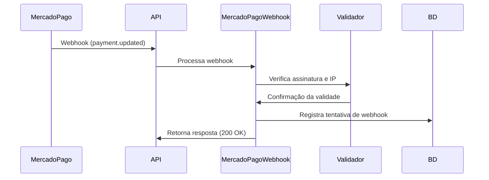
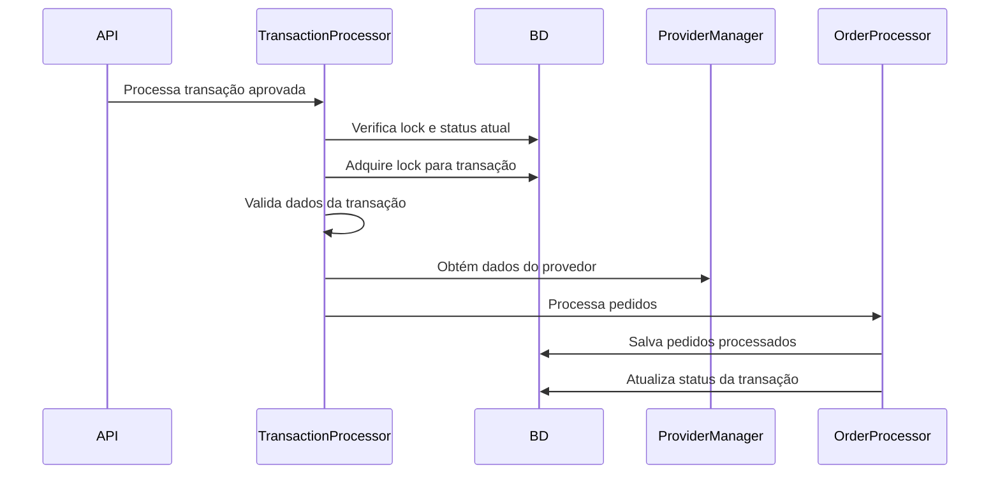
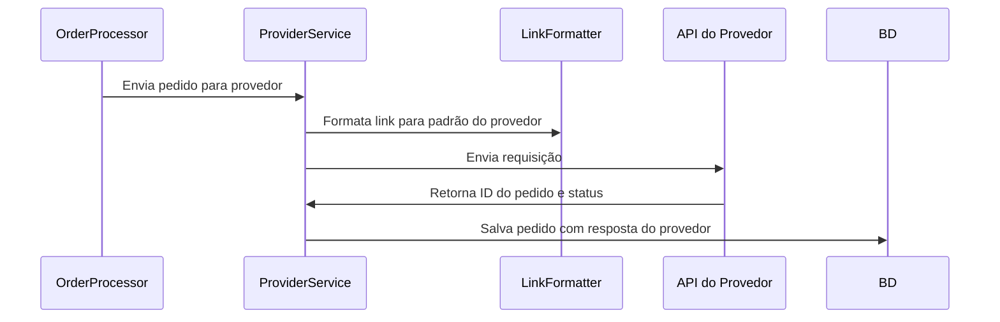
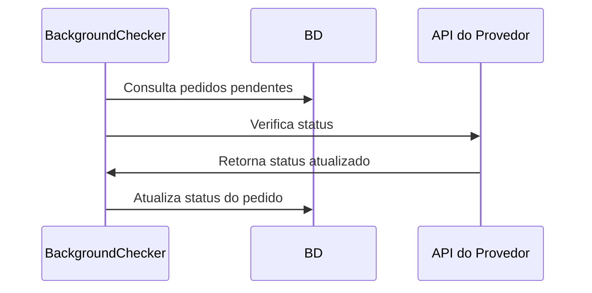
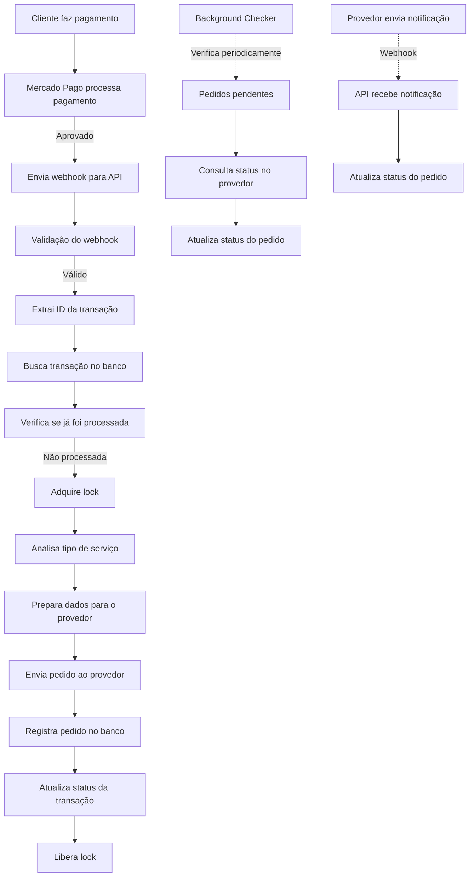

# Fluxo de Processamento de Transações

Este documento explica o fluxo completo de processamento de transações após o pagamento, detalhando como os diferentes serviços interagem entre si para processar pedidos de forma confiável.

## Visão Geral do Sistema

O sistema de processamento de transações é composto por 4 serviços principais:

1. **Serviço de Pagamento**: Gerencia a criação e verificação de pagamentos.
2. **Processador de Transações**: Responsável por transformar transações em pedidos.
3. **Serviço de Provedores**: Envia os pedidos para provedores externos.
4. **Serviço de Webhooks**: Recebe e processa notificações de status.

## Fluxo Detalhado de Processamento

### 1. Recebimento de Pagamento

Quando um pagamento é aprovado (via PIX, cartão de crédito ou outro método):

1. O Mercado Pago envia um webhook para nossa API (`/src/lib/transactions/modules/provider/webhooks/mercadoPagoWebhook.ts`).
2. O webhook é verificado através da validação de assinatura e verificação de IP.
3. O sistema extrai o ID da transação (referência externa) da notificação.
4. Se a notificação for de pagamento aprovado, o sistema inicia o processamento da transação.

### 2. Processamento da Transação

Após confirmação do pagamento:

1. O sistema carrega a transação do banco de dados através de seu ID.
2. Verifica se a transação já foi processada anteriormente (para evitar duplicação).
3. Implementa mecanismo de lock para garantir processamento único.
4. O processador analisa o tipo de serviço (curtidas, seguidores, etc.) e os metadados.
5. Divide a transação em um ou mais pedidos com base nos posts/links presentes.

### 3. Envio para Provedores

Para cada pedido criado:

1. Os links são formatados de acordo com as exigências do provedor específico.
2. Os dados do pedido são preparados (link, quantidade, ID do serviço).
3. O sistema envia a requisição à API do provedor.
4. A resposta do provedor é armazenada junto com o pedido.
5. O pedido é registrado no banco de dados com status inicial (geralmente "pendente").

### 4. Monitoramento e Atualização de Status

Após o envio para o provedor:

1. O sistema monitora periodicamente o status dos pedidos.
2. Webhooks de provedores podem notificar sobre mudanças de status.
3. O sistema atualiza o status dos pedidos conforme eles progridem.
4. Em caso de erros, o sistema registra logs detalhados.

## Detalhes dos Serviços Principais

### 1. Serviço de Pagamento

**Componentes:**
- `src/app/api/payment/create/route.ts`: Cria novos pagamentos
- `src/app/api/payment/pix/route.ts`: Gerencia pagamentos PIX
- `src/app/api/payment/verify-status/route.ts`: Verifica status de pagamentos
- `src/lib/services/backgroundPaymentChecker.ts`: Verifica pagamentos em segundo plano

**Responsabilidades:**
- Criar pagamentos no Mercado Pago
- Verificar status de pagamentos
- Atualizar o status das transações no banco de dados
- Iniciar o processamento de transações quando o pagamento for aprovado

### 2. Processador de Transações

**Componentes:**
- `src/lib/transactions/transactionProcessor.ts`: Função principal de processamento
- `src/lib/transactions/modules/orderProcessor.ts`: Processa ordens específicas
- `src/lib/transactions/modules/linkFormatter.ts`: Formata links para provedores

**Responsabilidades:**
- Analisar o tipo de serviço a ser processado
- Dividir transações em pedidos baseados em posts
- Garantir que uma transação seja processada apenas uma vez
- Registrar logs detalhados de cada etapa do processamento

### 3. Serviço de Provedores

**Componentes:**
- `src/lib/transactions/modules/provider/providerService.ts`: Gerencia provedores
- `src/lib/transactions/modules/provider/providerManager.ts`: Administra diferentes provedores

**Responsabilidades:**
- Enviar pedidos para APIs de provedores
- Formatar dados conforme exigências de cada provedor
- Interpretar respostas de provedores
- Verificar status de pedidos junto aos provedores

### 4. Serviço de Webhooks

**Componentes:**
- `src/lib/transactions/modules/provider/webhooks/mercadoPagoWebhook.ts`: Processa webhooks do Mercado Pago
- `src/app/api/webhooks/mercadopago/route.ts`: Endpoint para webhooks do Mercado Pago

**Responsabilidades:**
- Receber notificações de provedores
- Validar autenticidade dos webhooks
- Atualizar status de pagamentos e transações
- Registrar todas as notificações recebidas

## Prevenção de Duplicação

O sistema possui vários mecanismos para evitar a duplicação de pedidos:

1. **Locks de Transação**: Uma transação em processamento recebe um lock temporário
2. **Verificação de Pedidos Existentes**: Antes de processar, verifica se já existem pedidos
3. **Deduplicação de Posts**: Posts duplicados na mesma transação são filtrados
4. **Verificação de Links Processados**: Verifica se um link já foi processado antes de enviá-lo ao provedor

## Resposta de Pagamento

Quando o pagamento é confirmado, o sistema:

1. Atualiza o status da transação para "approved"
2. Processa a transação gerando os pedidos
3. Atualiza a flag "order_created" na transação
4. Salva o "order_id" do primeiro pedido na transação
5. Notifica o cliente sobre a aprovação (quando configurado)

## Logs e Monitoramento

O sistema mantém logs detalhados em várias tabelas:

- `transaction_logs`: Registra eventos relacionados ao processamento
- `webhook_callbacks`: Armazena todas as chamadas de webhook recebidas
- `transaction_processing`: Mantém o estado de processamento e locks
- `log_entries`: Logs gerais do sistema

## Diagrama Completo do Fluxo

## Conclusão

O sistema de processamento de transações é projetado para ser resiliente, evitar duplicações e registrar logs detalhados em cada etapa. A separação em diferentes serviços permite maior flexibilidade e facilita a manutenção. Os mecanismos de lock e verificação de status garantem que as transações sejam processadas de forma confiável, mesmo em caso de falhas temporárias.

Os scripts de diagnóstico (`/docs/diagnosticos.md`) fornecem ferramentas para verificar o status e resolver problemas em qualquer parte do fluxo, garantindo maior controle e observabilidade do sistema. 